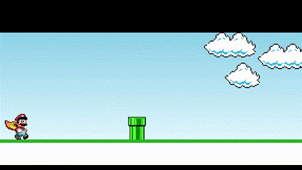

# Jogo Simples em JavaScript

Este jogo foi criado como parte de um projeto para praticar e aprender conceitos básicos de programação em JavaScript.

## Preview

[Link para acessar](https://juliasvgomes.github.io/mario.js/)
